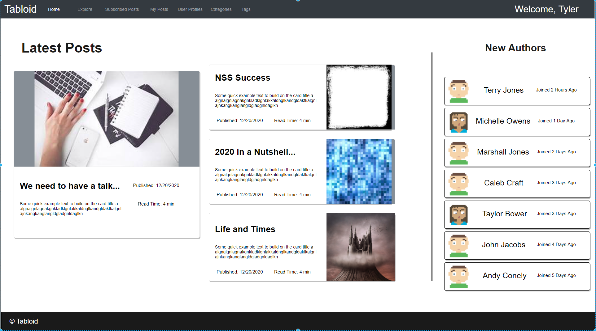

# Tabloid - Fullstack

## Description

A group project to build a full-stack website with a focus on authorization/authentication and CRUD functionality. In the form of an online news platform where users can create articles, comment on articles, classify the articles and tag the article. 

## Team Members

Chadwell Clark, Sidney Crandall, Bre Coach, Laurel Morrison and Nicholas Patton.

## Mock-Ups

### Login Page

### Home Page

### Explore Page

### Your Post's Page

### Create Post Form

### Post Details Page

### Category List Page

